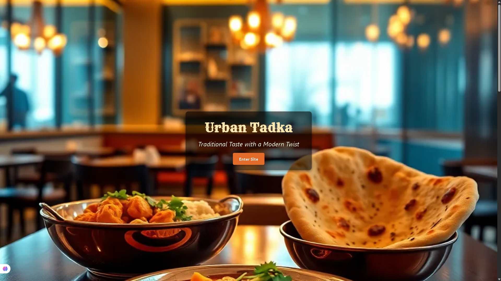
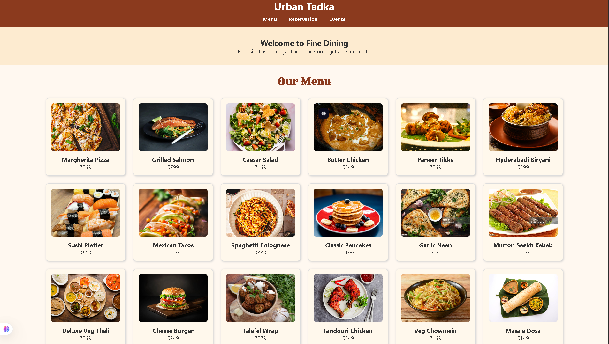
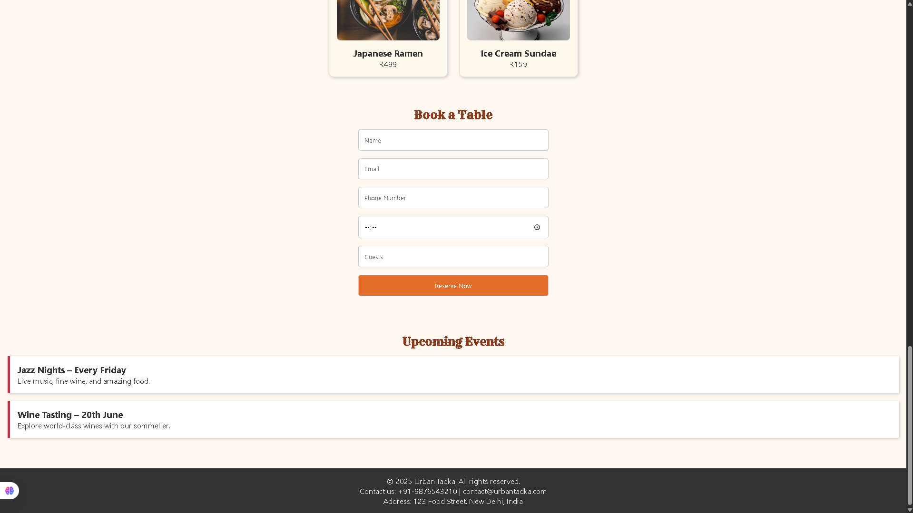

<div align="center">

<br/>


<br/>

<p>
  
  &nbsp;
  
  &nbsp;
  
  &nbsp;
  
  &nbsp;
  
  &nbsp;
  
</p>

<p>
  <a href="https://deykris777.github.io/Restraunt-website" target="_blank">
    
  </a>
  &nbsp;&nbsp;
  <a href="https://github.com/deykris777/Restraunt-website/issues">
    
  </a>
  &nbsp;&nbsp;
  <a href="https://github.com/deykris777/Restraunt-website/issues">
    
  </a>
</p>

</div>

---

## 📌 Table of Contents

- [Overview](#-overview)
- [Live Demo](#-live-demo)
- [Screenshots](#-screenshots)
- [Features](#-features)
- [Tech Stack](#-tech-stack)
- [Getting Started](#-getting-started)
- [Project Structure](#-project-structure)
- [Roadmap](#-roadmap)
- [Contributing](#-contributing)
- [Author](#-author)
- [License](#-license)

---

## 🍛 Overview

**Urban Tadka** is a production-quality, fully responsive restaurant website built entirely with vanilla web technologies — no frameworks, no dependencies. The project showcases modern frontend engineering through a seamless dining experience online: from browsing the curated menu to securing a reservation in seconds.

> *Designed to feel as premium on a 4-inch screen as it does on a 27-inch monitor.*

The website serves as both a practical template for F&B businesses and a demonstration of what thoughtful HTML, CSS, and JavaScript can achieve without the overhead of a build pipeline.

---

## 🌐 Live Demo

<div align="center">

| Environment | URL |
|---|---|
| 🟢 Production | [deykris777.github.io/Restraunt-website](https://deykris777.github.io/Restraunt-website) |
| 📁 Repository | [github.com/deykris777/Restraunt-website](https://github.com/deykris777/Restraunt-website) |

</div>

---

## 📸 Screenshots

<br/>

### 🎬 Hero Landing Page
*Immersive full-viewport welcome with atmospheric photography, brand tagline, and a clear call-to-action.*



<br/>

### 🍽️ Our Menu
*A dense, grid-based menu showcase — every dish displayed with photography, name, and INR pricing.*



<br/>

### 📋 Book a Table & Upcoming Events
*Clean reservation form with real-time input validation, alongside a curated events listing.*



---

## ✨ Features

<br/>

**Core Functionality**

- 📱 **Fully Responsive** — Mobile-first layout that scales gracefully from 320px to 4K displays
- 🍛 **Interactive Menu** — CSS Grid-powered food gallery with images, names, and ₹ pricing
- 📅 **Table Reservation** — Multi-field booking form capturing name, email, phone, time, and guest count
- 🎬 **Hero Section** — Full-bleed background image with centered brand identity and CTA
- 🎷 **Events Listing** — Structured upcoming events (Jazz Nights, Wine Tasting, and more)
- ✨ **UI Animations** — Smooth hover transitions, card lifts, and subtle entrance animations
- 🧭 **Navigation Bar** — Sticky top nav with links to Menu, Reservation, and Events sections
- 🦶 **Footer** — Contact info, address, and copyright — everything a business site needs

<br/>

**Design & Engineering**

- ⚡ Zero dependencies — no frameworks, no npm, no build step
- 🎨 Cohesive warm color palette (`#8B3A0F`, `#FFF8F0`) across all pages
- ♿ Semantic HTML5 for accessibility and SEO
- 🖼️ Optimized image loading for performance
- 🔒 Clean, readable code structure — easy to maintain and extend

---

## 🛠️ Tech Stack

```
Urban Tadka
├── Structure      →  HTML5 (Semantic markup, accessibility-first)
├── Presentation   →  CSS3 (Custom properties, Flexbox, Grid, transitions)
└── Behaviour      →  JavaScript ES6+ (DOM manipulation, form handling)
```

No build tools. No frameworks. No package.json. Just the web platform.

---

## 🚀 Getting Started

### Prerequisites

Any modern browser (Chrome 90+, Firefox 88+, Safari 14+, Edge 90+). That's it.

### Installation

**Clone the repository**

```bash
git clone https://github.com/deykris777/Restraunt-website.git
cd Restraunt-website
```

**Open locally**

```bash
# Option 1 — Direct browser open
open index.html                    # macOS
start index.html                   # Windows
xdg-open index.html                # Linux

# Option 2 — VS Code Live Server (recommended for development)
# Install the Live Server extension → right-click index.html → "Open with Live Server"

# Option 3 — Python simple server
python -m http.server 8000
# Then visit http://localhost:8000
```

> 💡 **Tip:** Using a local server (Option 2 or 3) avoids browser CORS restrictions when loading local assets.

---

## 📁 Project Structure

```
Restraunt-website/
│
├── index.html                  # Entry point — Hero landing page
├── menu.html                   # Full food menu
├── reservation.html            # Table reservation + events
│
├── css/
│   ├── style.css               # Global styles, variables, typography
│   ├── menu.css                # Menu grid & card styles
│   └── reservation.css         # Form layout & events section
│
├── js/
│   └── main.js                 # Navigation, form validation, interactions
│
├── images/
│   ├── hero-bg.jpg             # Hero section background
│   └── menu/                   # Individual dish photographs
│
├── screenshots/                # README screenshots
│   ├── hero.png
│   ├── menu.png
│   └── reservation-events.png
│
├── LICENSE
└── README.md
```

---

## 🗺️ Roadmap

The following improvements are planned for future releases:

- [ ] **v1.1** — Add cart & online ordering with localStorage persistence
- [ ] **v1.2** — Backend API integration (Node.js + Express) for real reservation handling
- [ ] **v1.3** — Email confirmation system via EmailJS or SendGrid
- [ ] **v1.4** — Admin dashboard to view and manage bookings
- [ ] **v2.0** — User accounts with reservation history and loyalty points
- [ ] **v2.1** — Google Maps embed and directions integration
- [ ] **v2.2** — Multi-language support (Hindi, Tamil, Bengali)
- [ ] **v2.3** — Customer reviews & star rating system
- [ ] **v2.4** — Dark mode toggle

See the [open issues](https://github.com/deykris777/Restraunt-website/issues) to track progress or suggest a feature.

---

## 🤝 Contributing

Contributions are what make open source extraordinary. Any contributions are **greatly appreciated**.

```bash
# 1. Fork the repository
# 2. Create your feature branch
git checkout -b feature/your-feature-name

# 3. Commit your changes (using Conventional Commits)
git commit -m "feat: add your feature description"

# 4. Push to your branch
git push origin feature/your-feature-name

# 5. Open a Pull Request on GitHub
```

Please follow [Conventional Commits](https://www.conventionalcommits.org/) format for all commit messages.

---

## 👤 Author

<div align="center">

<br/>

**Kris Dey**

*Frontend Developer · UI Enthusiast · Open Source Contributor*

<br/>

<a href="https://github.com/deykris777">
  
</a>

<br/><br/>

If you found this project helpful, please consider giving it a ⭐ — it means a lot and helps others discover it too.

</div>

---

## 📄 License

Distributed under the **MIT License**. See [`LICENSE`](LICENSE) for full terms.

---

<div align="center">

<br/>

*Built with care, curiosity, and an appetite for great design.*

<br/>

**Urban Tadka** &nbsp;·&nbsp; © 2025 Kris Dey &nbsp;·&nbsp; [MIT License](LICENSE)

<br/>

</div>
